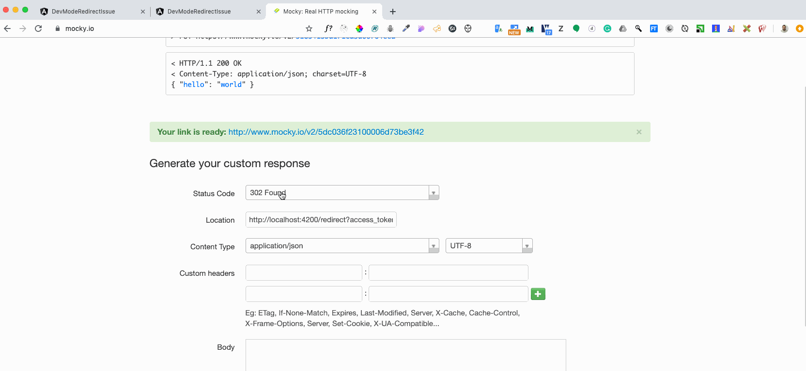

# DevModeRedirectIssue

This project was generated with [Angular CLI](https://github.com/angular/angular-cli) version 8.3.14.

## ISSUE

 Seems like statusCode 302 redirect response causes browser to do redirect, but it doesn't reach route address.
 
## Reproduce Gif:

